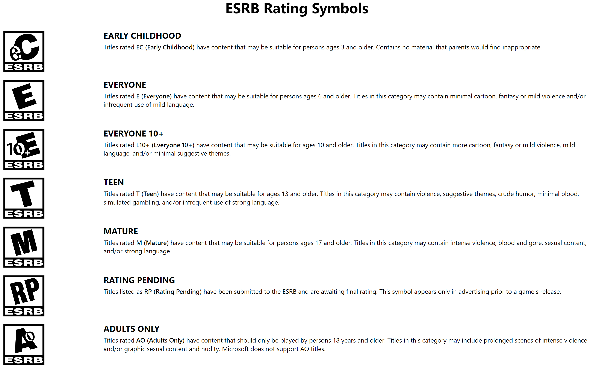

## Portfolio
---
### Shorts
[Cryptography - Encryption vs. Decryption](pdf/Cryptography-Encryption_vs._Decryption.pdf) 
[Types of Data Analytics](pdf/Types_of_Data_Analytics.pdf)

### Projects

[Malignant Melanoma - Variables that Increase Chance of Death](/melanoma)
<!--  -->
<!--  -->

<!--Good to post the below, incase want to add a better title/small analysis? -->
[VGChartz Video Game Sales](https://public.tableau.com/app/profile/heidi.tm/viz/VGChartzVideoGameSalesEDA/VGDashboard)   
<!--[]-->

<!-- [Gun Violence](/gun_violence) -->
<!--  -->

<!-- ---
[Project 2 Title](/pdf/sample_page)

---
[Project 3 Title](http://example.com/)

---

### Category Name 2

- [Project 1 Title](http://example.com/)
- [Project 2 Title](http://example.com/)
- [Project 3 Title](http://example.com/)
- [Project 4 Title](http://example.com/)
- [Project 5 Title](http://example.com/)

---
 -->
