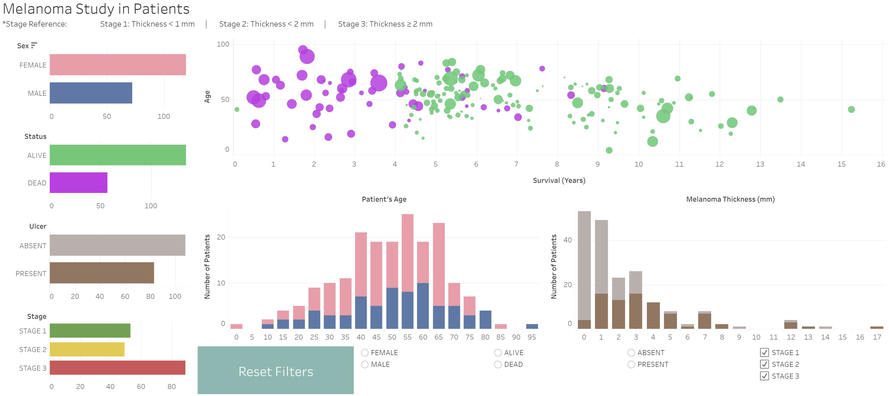

## .
---
### Shorts
[Cryptography - Encryption vs. Decryption](pdf/Cryptography-Encryption_vs._Decryption.pdf) 
[Types of Data Analytics](pdf/Types_of_Data_Analytics.pdf)

### Exploratory Data Analysis (EDA) 

[Melanoma Study](/sample_page)

<!-- ---
[Project 2 Title](/pdf/sample_presentation.pdf)

---
[Project 3 Title](http://example.com/)

---

### Category Name 2

- [Project 1 Title](http://example.com/)
- [Project 2 Title](http://example.com/)
- [Project 3 Title](http://example.com/)
- [Project 4 Title](http://example.com/)
- [Project 5 Title](http://example.com/)

---
 -->
